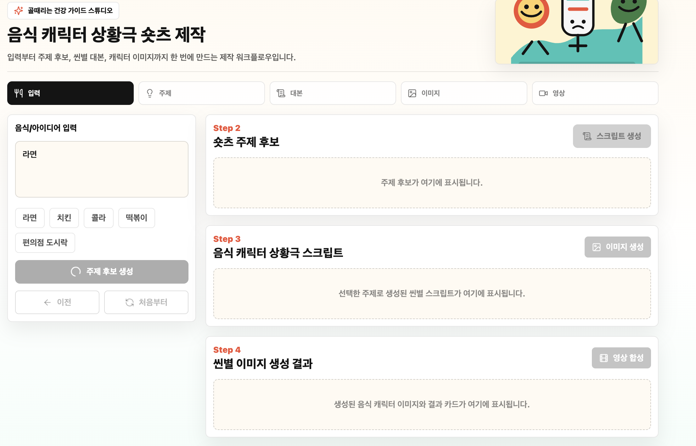
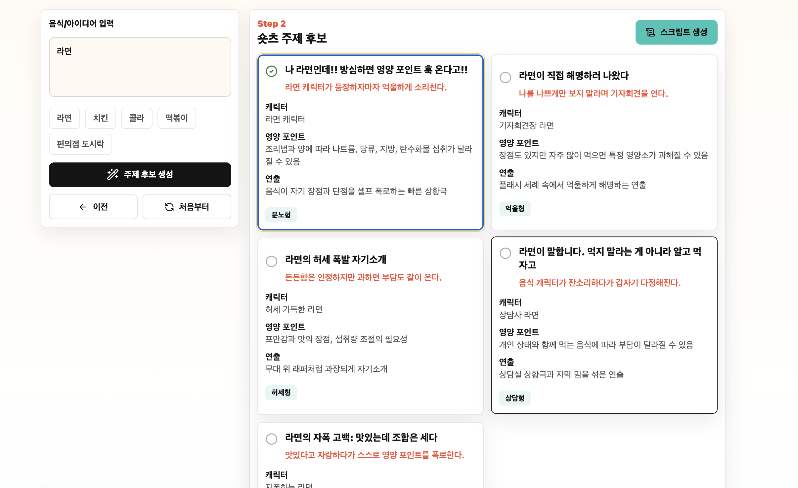
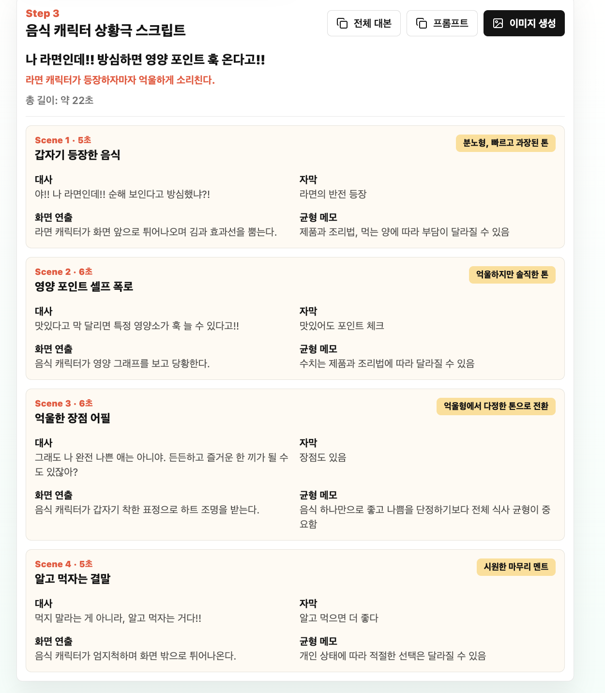

# 골때리는 건강 가이드 스튜디오

음식 이름이나 아이디어를 입력하면 AI가 숏츠 주제 후보, 상황극 대본, 씬별 이미지, TTS 음성, 자막, MP4 영상을 생성하는 숏폼 콘텐츠 제작 워크플로우입니다.

## 내가 맡은 역할

- 로컬 LLM/TTS API 구축 및 외부 배포
- 음식/건강 숏츠 생성을 위한 AI 워크플로우 연동
- zrok을 이용한 로컬 AI 서버 public URL 공유
- Qwen3 기반 텍스트 생성 API 연결
- Qwen3-TTS 기반 한국어 TTS API 테스트 및 연동
- 풀스택 연동을 위한 API 명세 정리
- 발표자료와 GitHub README 문서화

## Tech Stack

| 영역 | 사용 기술 |
| --- | --- |
| Frontend | Next.js, React, TypeScript, Tailwind CSS |
| Backend | Next.js Route Handlers, TypeScript |
| Text AI | Ollama, `qwen3:4b`, zrok public API |
| TTS AI | `Qwen/Qwen3-TTS-12Hz-0.6B-CustomVoice`, Docker |
| Image/Video | Image generation API, FFmpeg |
| Deploy/Share | Vercel, zrok, GitHub |

## 주요 기능

- 음식/아이디어 입력
- 숏츠 주제 후보 생성
- 주제 선택 후 씬별 상황극 대본 생성
- 씬별 이미지 프롬프트 및 이미지 생성
- 씬별 TTS 음성 생성
- SRT 자막 생성
- 이미지, 음성, 자막을 합성한 MP4 영상 생성
- 생성 결과 JSON 다운로드

## Demo

### 1. 입력 화면

음식 또는 아이디어를 입력하면 이후 단계에서 사용할 주제 후보를 생성합니다.



### 2. 숏츠 주제 후보 생성

입력한 음식에 맞춰 여러 개의 숏츠 주제 후보를 생성하고, 캐릭터/영양 포인트/연출 방향을 함께 제안합니다.



### 3. 상황극 스크립트 생성

선택한 주제를 기반으로 씬별 대사, 자막, 화면 연출, 균형 메모를 생성합니다.



### 4. 씬별 이미지 생성 결과

각 씬의 대본과 이미지 프롬프트를 기반으로 숏츠용 이미지를 생성합니다.

### 5. TTS, 자막, 영상 합성 결과

씬별 TTS 음성 클립과 MP4/SRT 결과를 확인하는 단계입니다.

## AI API 구성

### Text LLM

```text
Model: qwen3:4b
Alias: local-qwen-4b
Runtime: Ollama
Public share: zrok
```

텍스트 생성에는 `qwen3:4b`를 사용했습니다. 3B 이상 4B급 로컬 LLM 조건을 만족하고, Ollama를 통해 OpenAI 호환 API 형태로 쉽게 서빙할 수 있어 선택했습니다.

### TTS

```text
Model: Qwen/Qwen3-TTS-12Hz-0.6B-CustomVoice
Speaker: Sohee
Runtime: Docker + qwen-tts
Output: WAV
```

처음에는 Orpheus 3B Korean TTS를 테스트했지만, 현재 환경에서 GPU Docker가 잡히지 않아 CPU 모드로 매우 느리게 동작했습니다. 이후 시연 안정성을 위해 더 가벼운 Qwen3-TTS 0.6B 모델로 교체했습니다.

## 실행 방법

```bash
npm install
npm run dev
```

기본 실행 주소:

```text
Web: http://localhost:3000
API: http://localhost:3001
```

로컬 LLM/TTS API 실행은 `local-llm/README.md`를 참고합니다.

## API 요약

| Method | Endpoint | 설명 |
| --- | --- | --- |
| GET | `/api/health` | API 상태 확인 |
| POST | `/api/topics` | 음식/아이디어 기반 주제 후보 생성 |
| POST | `/api/script` | 선택 주제 기반 씬별 대본 생성 |
| POST | `/api/images` | 씬별 이미지 생성 |
| POST | `/api/audio` | 씬별 TTS 생성 |
| POST | `/api/compose` | 음성, 자막, 이미지를 영상으로 합성 |
| GET | `/api/generated/{jobId}/{filename}` | 생성 파일 조회 |

## 어려웠던 점과 해결 과정

### 1. 로컬 AI 모델을 API로 연결하는 문제

처음에는 모델을 단순히 로컬에서 실행하는 것과 프론트엔드에서 호출 가능한 API로 만드는 것의 차이가 컸습니다.

해결:

- Ollama를 사용해 `qwen3:4b`를 로컬에서 실행했습니다.
- wrapper API를 만들어 `/chat`, `/v1/chat/completions` 형태로 호출할 수 있게 했습니다.
- zrok을 이용해 로컬 API를 외부에서 접근 가능한 public URL로 공유했습니다.

### 2. TTS 모델 선택과 속도 문제

초기에는 3B급 조건을 맞추기 위해 Orpheus 3B Korean TTS를 사용했습니다. 하지만 Docker 환경에서 GPU가 정상적으로 잡히지 않아 CPU 모드로 실행되었고, 짧은 문장 생성에도 시간이 오래 걸렸습니다.

해결:

- Orpheus 3B Korean을 실제로 테스트해 병목을 확인했습니다.
- 시연 안정성을 위해 `Qwen/Qwen3-TTS-12Hz-0.6B-CustomVoice`로 교체했습니다.
- TTS speaker는 한국어 지원 speaker인 `Sohee`로 설정했습니다.

### 3. zrok timeout 문제

로컬에서는 TTS가 생성되지만, zrok public URL을 통해 호출하면 생성 시간이 길어져 `context canceled` 또는 timeout이 발생했습니다.

해결:

- `/health`, `/tts/voices`로 서버 자체는 정상임을 확인했습니다.
- 문제 원인이 네트워크 연결이 아니라 긴 TTS 생성 시간이라는 것을 파악했습니다.
- 이후에는 짧은 문장으로 테스트하고, 실제 서비스에서는 비동기 job 방식으로 개선해야 한다는 방향을 정리했습니다.

### 4. 이미지 생성 품질 문제

일부 이미지에 의미 없는 글자처럼 보이는 텍스트가 포함되는 문제가 있었습니다.

해결:

- 이미지 프롬프트에 `no text`, `no letters`, `clean empty space for subtitle` 같은 조건을 추가했습니다.
- 씬별 이미지 카드에서 프롬프트를 확인하고 복사할 수 있게 하여 반복 수정이 가능하도록 했습니다.

## 남은 이슈

최종적으로 TTS 음성 파일 생성 자체는 성공했지만, 합성 영상에 TTS 목소리가 정상적으로 나오지 않는 문제가 있었습니다.

원래는 이 부분까지 수정해서 영상 합성 결과물에 음성이 포함되도록 마무리하려고 했습니다. 하지만 작업 중 사용 가능한 토큰을 모두 소진해 더 이상 디버깅을 이어가지 못했고, 결국 이 부분은 눈물을 머금고 미해결 상태로 마무리했습니다.

## 회고

이번 프로젝트를 통해 단순히 AI 모델을 호출하는 것보다, 모델 실행 환경과 API 연결, 외부 배포, 프론트엔드 워크플로우까지 이어지는 전체 파이프라인이 훨씬 중요하다는 것을 배웠습니다.

특히 로컬 AI 모델은 GPU, Docker, timeout, 파일 경로, 외부 터널링 같은 환경 이슈가 결과물 품질만큼 중요했습니다. 다음에는 TTS 생성과 영상 합성을 비동기 job 구조로 바꾸고, 생성된 음성 파일이 MP4 합성 단계에 안정적으로 포함되도록 개선하고 싶습니다.
